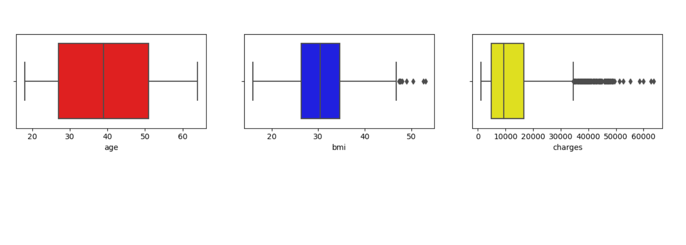
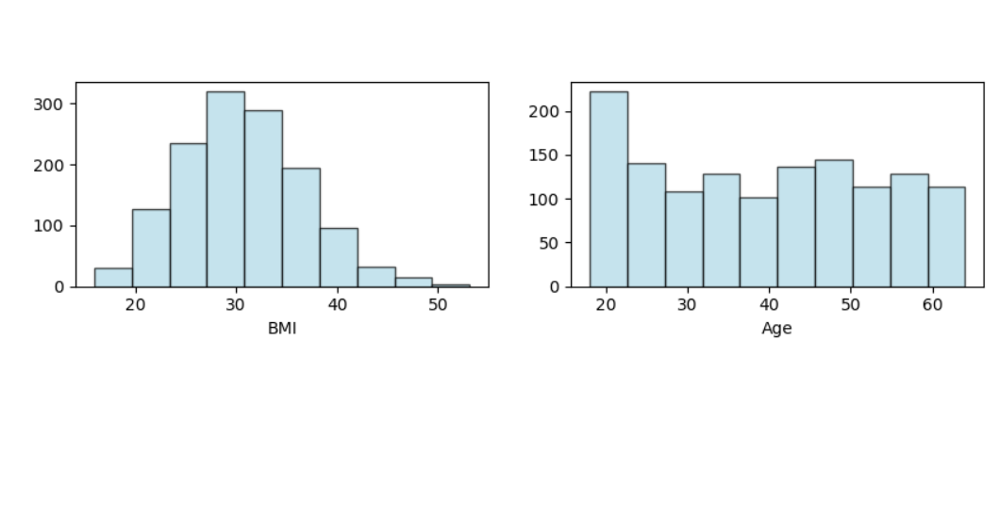
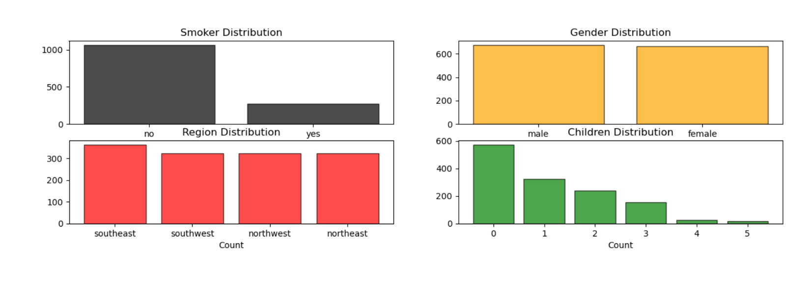
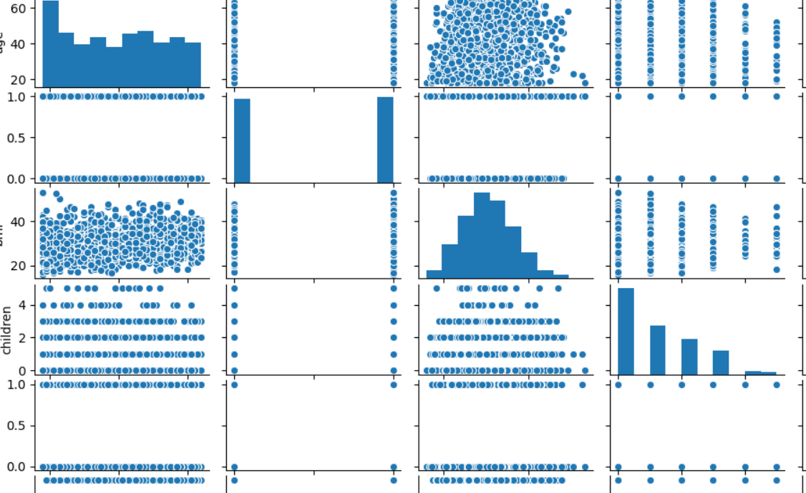
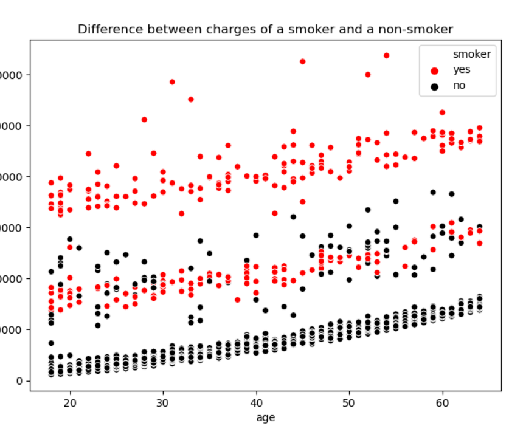

# Exploratory-Data-Analysis-using-Python
A beginners guide for EDA.

EDA techniques are used to create visual methods to analyze trends, patterns, and relationships in the data.

Some of the techniques for the data analysis in this project used are:

Box Plots:

Histograms:

Bar Graphs:

Pairplots:

Scatter Plots:

